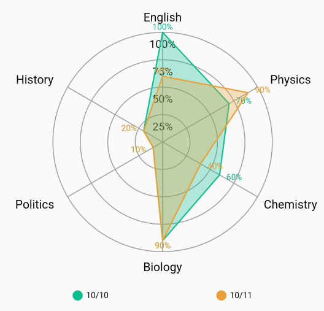
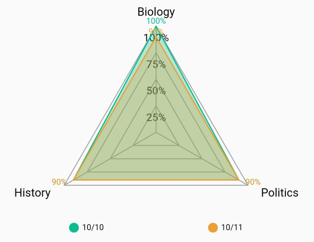
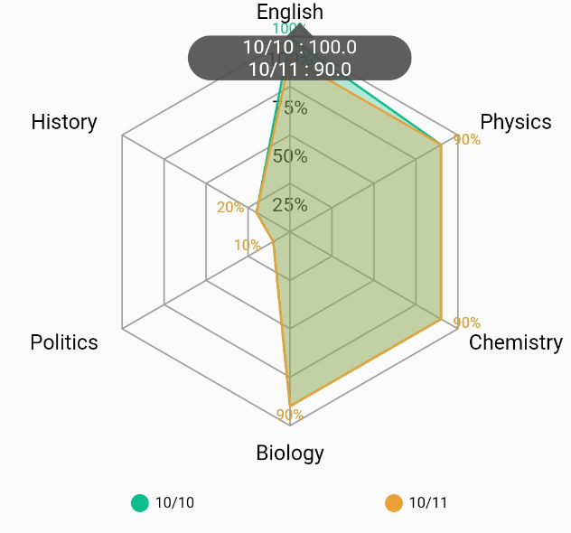
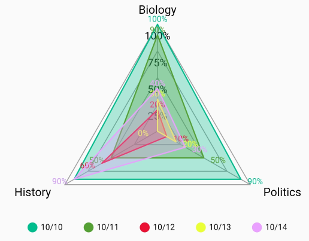
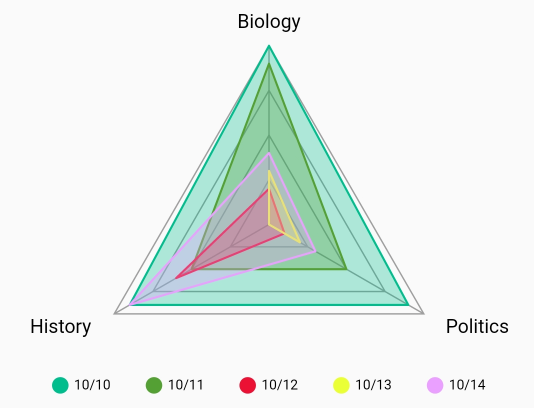
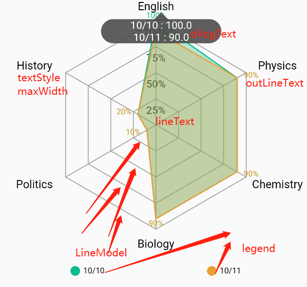

## kg_charts
## kg_charts 图标库，目前只有雷达图表，后期可能新增其他类型图表

### 开始集成

```dart
dependencies:
  kg_charts: ^0.0.2
```

雷达图表效果如下











图片说明



使用方法例：

```dart

RadarWidget(
            radarMap: RadarMapModel(
                legend: [
                  LegendModel('10/10',const Color(0XFF0EBD8D)),
                  LegendModel('10/11',const Color(0XFFEAA035)),
                ],
                indicator: [
                  IndicatorModel("English",100),
                  IndicatorModel("Physics",100),
                  IndicatorModel("Chemistry",100),
                  IndicatorModel("Biology",100),
                  IndicatorModel("Politics",100),
                  IndicatorModel("History",100),
                ],
                data: [
                  //   MapDataModel([48,32.04,1.00,94.5,19,60,50,30,19,60,50]),
                  //   MapDataModel([42.59,34.04,1.10,68,99,30,19,60,50,19,30]),
                  MapDataModel([100,90,90,90,10,20]),
                  MapDataModel([90,90,90,90,10,20]),
                ],
                radius: 130,
                duration: 2000,
                shape: Shape.square,
                maxWidth: 70,
                line: LineModel(4),
            ),
            textStyle: const TextStyle(color: Colors.black,fontSize: 14),
            isNeedDrawLegend: true,
            lineText: (p,length) =>  "${(p*100~/length)}%",
            dilogText: (IndicatorModel indicatorModel,List<LegendModel> legendModels,List<double> mapDataModels) {
              StringBuffer text = StringBuffer("");
              for(int i=0;i<mapDataModels.length;i++){
                text.write("${legendModels[i].name} : ${mapDataModels[i].toString()}");
                if(i!=mapDataModels.length-1){
                  text.write("\n");
                }
              }
              return text.toString();
            },
            outLineText: (data,max)=> "${data*100~/max}%",
          ),

```

参数说明：

| 参数 | 类型 | 是否必要 | 说明
|--|--|--|--|
| radarMap| RadarMapModel| 是| 包含 图例，雷达点，雷达数据，半径 ，雷达种类（圆形，方形），文字最大宽度，内部画几条线（LineModel中包含绘制线颜色，文字大小等）  |
| textStyle | style | 否 | 外部绘制文字颜色与大小 |
|isNeedDrawLegend  | bool  |  否 | 默认为true |
| lineText | fun | 否  | 内部线上画的文字，根据数据动态生成，如果为空则不展示 |
|dilogText  |  fun | 否  | 点击出现的dialog，根据数据动态生成，如果为空则不展示 |
| outLineText | fun  | 否  | 外部线上画的文字，根据数据动态生成，如果为空则不展示 |
